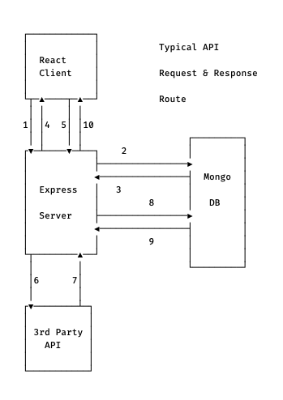

# I-Ching Server

This is the Express server which will make the API calls to a 3rd party API and connect to a MongoDB database. The user will have the abilty to create, retrieve, update, and delete information from the database through the client.

### API Call Route

